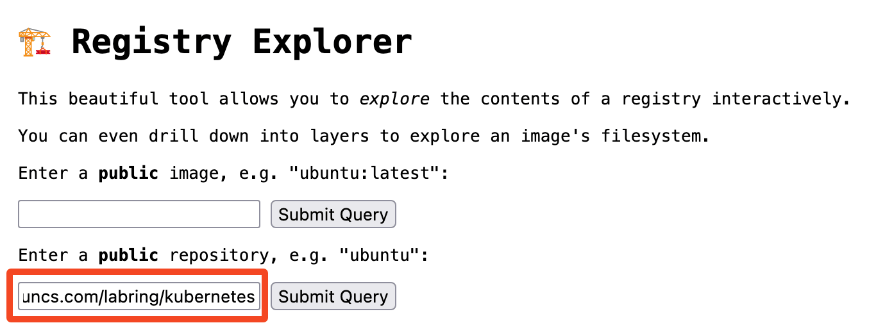

# 一主两从安装

## 准备
关闭交换内存，关闭 selinux，更新源

## 前置配置-所有节点执行

### 修改主机名和hosts配置

```bash
1. 修改主机名
# platform
hostnamectl set-hostname k8s-master
hostnamectl set-hostname k8s-node01
hostnamectl set-hostname k8s-node02

2. 配置hosts(必须配),例下（所有集群都配置，自身的集群hosts即可）
$ vi /etc/hosts
xxx.xxx.xxx.xxx k8s-master01
xxx.xxx.xxx.xxx k8s-node01
xxx.xxx.xxx.xxx k8s-node02
```

### 配置时间同步

```bash
chronyc sources

#方式1：安装配置chrony时间同步
IP=`ip addr | grep 'state UP' -A2 | grep inet | egrep -v '(127.0.0.1|inet6|docker)' | awk '{print $2}' | tr -d "addr:" | head -n 1 | cut -d / -f1`
yum install -y chrony
sed -i '3,6s/^/#/g' /etc/chrony.conf
sed -i "7s|^|server ntp1.aliyun.com iburst|g" /etc/chrony.conf
echo"allow all" >> /etc/chrony.conf
echo"local stratum 10" >> /etc/chrony.conf
systemctl restart chronyd
systemctl enable chronyd
timedatectl set-ntp true
sleep 5
systemctl restart chronyd
chronyc sources

#方式2：时间同步  注意：系统重启后恢复成原时间
yum install ntpdate -y
ntpdate ntp1.aliyun.com
```

### 安装ptables

`dnf install -y iptables iptables-nft iproute-tc conntrack-tools socat net-tools`

## sealos创建k8s集群

### 安装sealos CLI

[安装文档](https://sealos.run/docs/advanced/k8s/getting-started/install-cli)

### 使用sealos创建k8s集群

[Sealos部署k8s文档](https://sealos.run/docs/advanced/k8s/getting-started/deploy-kubernetes)

[查看k8s集群镜像的所有tag](https://explore.ggcr.dev/)


> K8s 的小版本号越高，集群越稳定。例如 v1.29.x，其中的 x 就是小版本号。建议使用小版本号比较高的 K8s 版本。

```bash
# 指令参考
sealos run \
    registry.cn-shanghai.aliyuncs.com/labring/kubernetes:v1.30.14 \
    registry.cn-shanghai.aliyuncs.com/labring/helm:v4.0.1 \
    registry.cn-shanghai.aliyuncs.com/labring/calico:v3.28.1 \
    --masters 192.168.0.2 \
    --nodes 192.168.0.3,192.168.0.4 \
    -p [your-ssh-passwd]
```

| 参数名 | 参数值示例 | 参数说明 |
| --- | --- | --- |
| `--masters` | `192.168.0.2` | K8s master 节点地址列表 |
| `--nodes` | `192.168.0.3, 192.168.0.4` | K8s node 节点地址列表 |
| `--ssh-passwd` | `[your-ssh-passwd]` | ssh 登录密码 |
| `kubernetes` | `xxx.xxx.xxx/labring/kubernetes:v1.30.14` | K8s 集群镜像 |

### 增加K8s节点

- **增加Master节点**：`sealos add --masters xxx.xxx.xxx.xxx`
- **增加node节点**：`sealos add --nodes xxx.xxx.xxx.xxx`

### 删除k8s节点

- **删除Master节点**：`sealos delete --masters xxx.xxx.xxx.xxx`
- **删除node节点**：`sealos delete --nodes xxx.xxx.xxx.xxx`

### 清理k8s集群

- **清理k8s集群**：`sealos reset`

> ⚠️ 以下内容已废弃，仅作历史参考。

## ~~安装 docker~~

~~[https://docs.docker.com/engine/install](https://docs.docker.com/engine/install)~~

## ~~安装 cri-docker~~

~~[容器运行时文档](https://kubernetes.io/zh-cn/docs/setup/production-environment/container-runtimes/)~~

~~[https://github.com/Mirantis/cri-dockerd](https://github.com/Mirantis/cri-dockerd)~~

~~[https://mirantis.github.io/cri-dockerd/usage/install-manually/](https://mirantis.github.io/cri-dockerd/usage/install-manually/)~~

::: warning 已废弃
```bash
cat > /etc/docker/daemon.json <<EOF
{
"registry-mirrors": ["https://docker.1ms.run/"],
"exec-opts": ["native.cgroupdriver=systemd"]
}
EOF

# 修改/etc/systemd/system/cri-docker.service
ExecStart=/usr/local/bin/cri-dockerd --pod-infra-container-image=registry.aliyuncs.com/google_containers/pause:3.10.1 --container-runtime-endpoint fd://
systemctl daemon-reload && systemctl restart cri-docker
```
:::

## ~~安装 kubeadm，仅主~~

~~[https://kubernetes.io/zh-cn/docs/setup/production-environment/tools/kubeadm/install-kubeadm/](https://kubernetes.io/zh-cn/docs/setup/production-environment/tools/kubeadm/install-kubeadm/)~~

> ```bash
> kubeadm init --apiserver-advertise-address=192.168.31.200 --image-repository=registry.aliyuncs.com/google_containers --kubernetes-version=v1.35.1 --service-cidr=10.10.0.0/12 --pod-network-cidr=10.244.0.0/16 --ignore-preflight-errors=all --cri-socket=unix:///var/run/cri-dockerd.sock
> ```

## ~~安装网络插件 (calico)~~

~~[https://kubernetes.io/zh-cn/docs/concepts/cluster-administration/networking/#how-to-implement-the-kubernetes-network-model](https://kubernetes.io/zh-cn/docs/concepts/cluster-administration/networking/#how-to-implement-the-kubernetes-network-model)~~

~~[https://docs.tigera.io/calico/latest/getting-started/kubernetes/self-managed-onprem/onpremises](https://docs.tigera.io/calico/latest/getting-started/kubernetes/self-managed-onprem/onpremises)~~

> ```bash
> wget https://raw.githubusercontent.com/projectcalico/calico/v3.31.3/manifests/operator-crds.yaml
> wget https://raw.githubusercontent.com/projectcalico/calico/v3.31.3/manifests/tigera-operator.yaml
> # 将custom-resources-bpf.yaml中的cidr: 192.168.0.0/16修改为10.244.0.0/16
> wget https://raw.githubusercontent.com/projectcalico/calico/v3.31.3/manifests/custom-resources-bpf.yaml
> kubectl create -f custom-resources-bpf.yaml && kubectl create -f  operator-crds.yaml && kubectl create -f tigera-operator.yaml
> ```